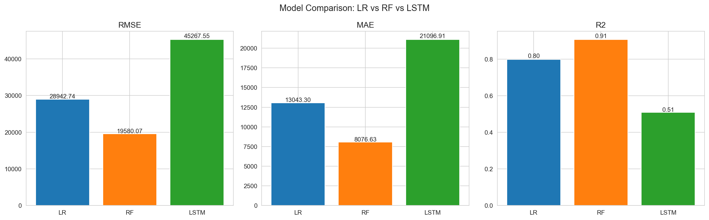
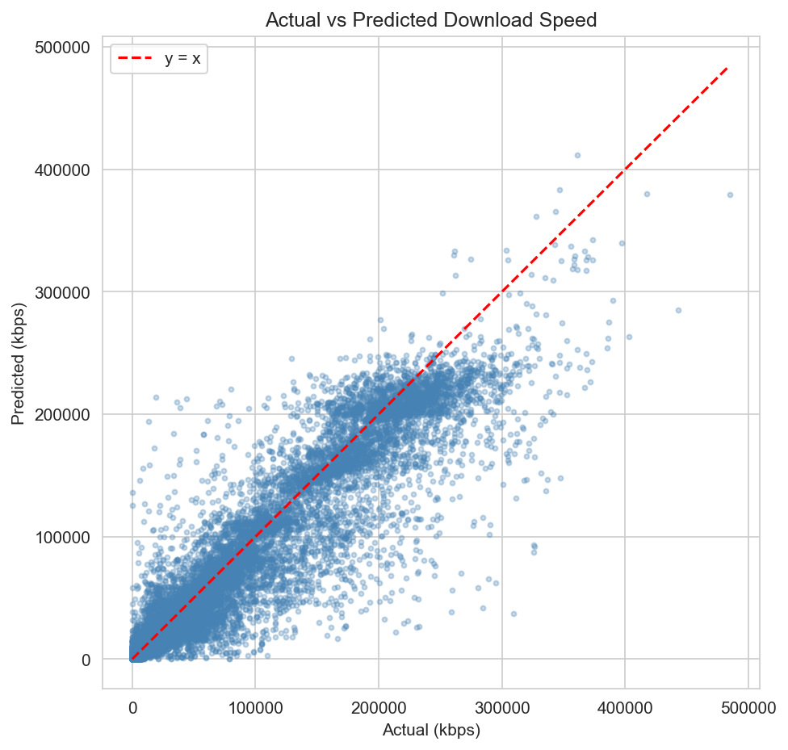
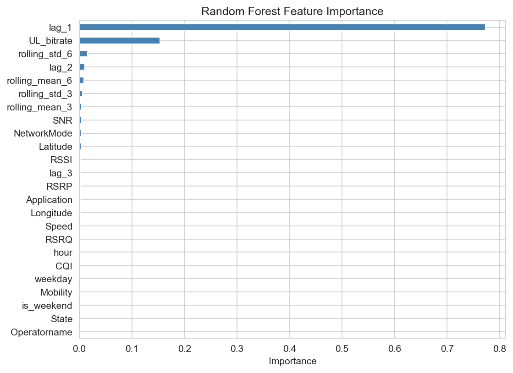

# 📡 5G Network Traffic Prediction

This project analyses real-world 5G drive-test data and builds machine learning models to predict network throughput. Using 188,711 measurements from the uccmisl/5Gdataset (ACM MMSys 2020), we compare Linear Regression, Random Forest, and LSTM approaches. Random Forest achieves R² = 0.909, confirming that the task is feature-driven rather than sequence-driven.

## 📁 Project Structure

```
5g_traffic_prediction/
├── data/
│   ├── raw/                # Original datasets (from GitHub)
│   └── processed/          # Cleaned / feature-engineered data
├── notebooks/              # Jupyter notebooks for EDA and experiments
├── results/
│   ├── figures/            # Plots and visualizations
│   └── models/             # Trained model artifacts (.pkl)
├── src/
│   ├── __init__.py         # Package init
│   ├── config.py           # Paths and global settings
│   ├── data_loader.py      # Load raw data
│   ├── preprocessing.py    # Clean data and build features
│   ├── analysis.py         # Traffic pattern / peak-hour analysis
│   ├── model.py            # Linear Regression, Random Forest, LSTM
│   ├── evaluation.py       # RMSE / MAE / R²
│   ├── visualization.py    # Plotting helpers
│   └── main.py             # End-to-end pipeline entry point
├── requirements.txt
└── README.md
```

## 👥 Team & Roles

| Member      | Role                                     |
|-------------|------------------------------------------|
| WANG JIARUI | Full pipeline: dataset selection & migration, preprocessing, feature engineering, model building (LR/RF/LSTM), evaluation, visualization, notebooks, video production |
| LIU ZHENYI  | Dataset collection & initial research    |
| REN XUHUI   | Report writing                           |
| YANG XIAOLU | Presentation slides (PPT)                |

## 📊 Dataset

- **Source**: [uccmisl/5Gdataset](https://github.com/uccmisl/5Gdataset) — real-world 5G
  drive-test traces from a major Irish mobile operator, collected via G-NetTrack Pro
- **Mobility patterns**: Static and Driving (car)
- **Application patterns**: video streaming (Netflix, Amazon Prime) and file download
- **Metrics**: channel (RSRP, RSRQ, SNR, CQI, RSSI), context (location, speed, network
  mode), and throughput (DL/UL bitrate). This is the first publicly available 5G dataset
  combining throughput with channel and context information.
- **Size**: 188,711 rows, 1-second granularity, 27 dates (2019-11-20 to 2020-02-27)
- **Raw features**: RSRP, RSRQ, SNR, CQI, RSSI, UL_bitrate, Speed, Longitude,
  Latitude, NetworkMode, Operatorname, Application, Mobility, State
- **Engineered features**: hour, weekday, is_weekend, lag_1, lag_2, lag_3,
  rolling_mean_3, rolling_mean_6, rolling_std_3, rolling_std_6
- **Target**: DL_bitrate (mean 10,758 kbps, max 532,905 kbps)

> Only the real-world drive-test traces are used. The accompanying ns-3 simulation
> framework is not included in this analysis.

> **Reference**: D. Raca, D. Leahy, C.J. Sreenan and J.J. Quinlan. *Beyond Throughput,
> The Next Generation: A 5G Dataset with Channel and Context Metrics.* ACM Multimedia
> Systems Conference (MMSys), Istanbul, Turkey, June 8–11, 2020.

## 📈 Model Performance

| Model            | RMSE      | MAE     | R²     |
|------------------|-----------|---------|--------|
| Linear Regression | 28,998   | 13,086  | 0.799  |
| Random Forest     | 19,538   | 8,086   | 0.909  |
| LSTM             | 50,604   | 24,158  | 0.389  |
| LSTM + lag       | 34,320   | 16,306  | 0.719  |



✅ **Random Forest is the recommended model.** This dataset is feature-driven rather
than sequence-driven: the strongest predictive signal is lag-1 autocorrelation
(0.89), which tree-based models exploit directly via engineered lag/rolling
features. Recurrent architectures must learn the same patterns from raw noisy
radio-frequency (RF) signal measurements over a limited window, making them a less natural fit here.
Even when provided with equivalent lag-based temporal features, LSTM+lag (R²=0.719)
still underperforms both Linear Regression (R²=0.799) and Random Forest (R²=0.909),
confirming that this dataset is inherently feature-driven rather than sequence-driven.





## Known Limitations (all resolved)

- ~~**Rolling feature session boundary**: `add_rolling_features()` computed
  rolling statistics without session-boundary isolation.~~ **Resolved** —
  session-aware rolling via `timestamps` parameter prevents cross-session leakage.

- ~~**Lag feature session boundary**: `add_lag_features()` had the same
  cross-session leakage at drive-test boundaries.~~ **Resolved** — session-aware
  lag via `timestamps` parameter prevents cross-session leakage.

- **Evaluation set size mismatch**: LR/RF are evaluated on ~37,533 samples;
  LSTM variants on ~36,783 / ~36,633 (after session-boundary filtering).
  This is a deliberate trade-off: discarding cross-session sequences is
  the correct behaviour, not a data leak.

## Conclusion

Random Forest is the clear winner for this 5G throughput prediction task
(R² = 0.909). The dataset is fundamentally feature-driven, not sequence-driven:
lag-1 autocorrelation (0.89) is the dominant signal, and tree-based models
exploit it directly via engineered features while recurrent architectures
must infer it from noisy RF measurements over a limited window.

LSTM instability further reinforces this conclusion: across PyTorch versions
the same code and seed produce R² ranging from 0.39 to 0.52, while RF stays
within 0.907–0.909 regardless of platform. For production 5G traffic
prediction with tabular drive-test data, Random Forest is both the most
accurate and most reliable choice.

## 🚀 Quick Start

Requires Python 3.12.x (or 3.10+).

```bash
pip install -r requirements.txt
python -m src.main
```

- GPU (CUDA): ~15–20 min
- CPU only: ~30–60 min
- Figures saved to `results/figures/`
- Trained models saved to `results/models/`

## 📅 Timeline

- Week 1–2: Dataset collection & initial research
- Week 3–4: Data preprocessing & traffic pattern analysis
- Week 5–6: Model building & traffic prediction
- Week 7: Visualization & result analysis
- Week 8: Final report & presentation
